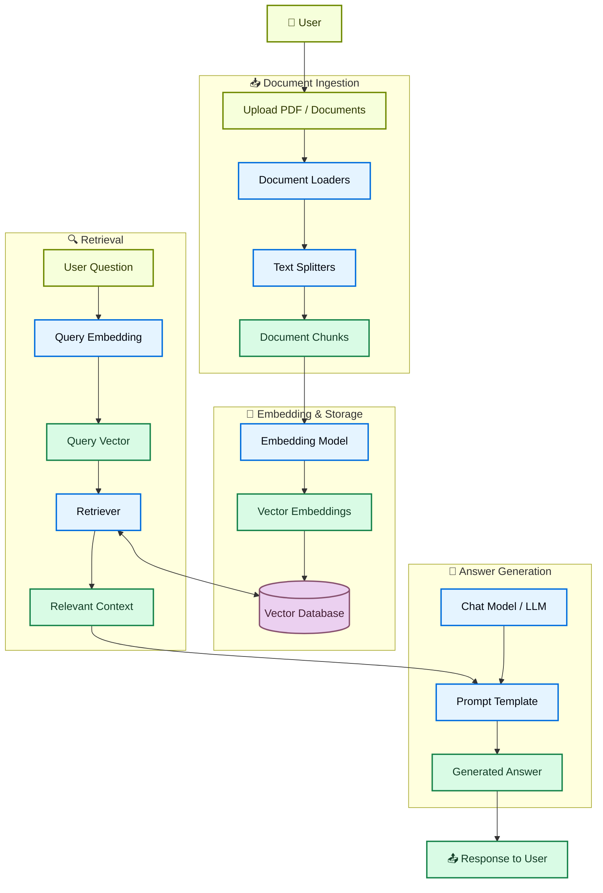

```mermaid
flowchart TD
    A["👤 User"] --> B["Upload PDF / Documents"]

    subgraph INGESTION["📥 Document Ingestion"]
        B --> C["Document Loaders"]
        C --> D["Text Splitters"]
        D --> E["Document Chunks"]
    end

    subgraph EMBEDDING["🔢 Embedding & Storage"]
        E --> F["Embedding Model"]
        F --> G["Vector Embeddings"]
        G --> H[("Vector Database")]
    end

    subgraph RETRIEVAL["🔍 Retrieval"]
        I["User Question"] --> J["Query Embedding"]
        J --> K["Query Vector"]
        K --> L["Retriever"]
        L <--> H
        L --> M["Relevant Context"]
    end

    subgraph GENERATION["🤖 Answer Generation"]
        M --> N["Prompt Template"]
        O["Chat Model / LLM"] --> N
        N --> P["Generated Answer"]
    end

    P --> Q["📤 Response to User"]

    classDef input fill:#F6FFDB,stroke:#6E8900,stroke-width:2px,color:#2E3900
    classDef process fill:#E5F4FF,stroke:#006DDD,stroke-width:2px,color:#030710
    classDef storage fill:#EBD0F0,stroke:#885270,stroke-width:2px,color:#441E33
    classDef output fill:#D9FBE5,stroke:#16834A,stroke-width:2px,color:#123D26

    class A,B,I input
    class C,D,F,J,L,N,O process
    class H storage
    class E,G,K,M,P,Q output
```
