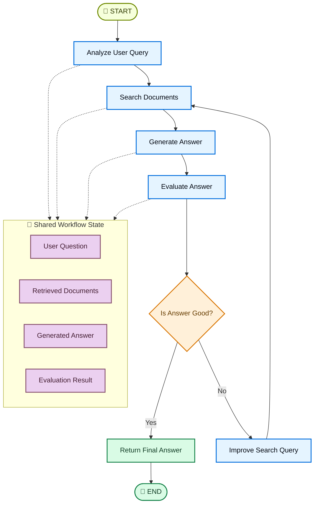

```mermaid
flowchart TD
    A(["🚀 START"]) --> B["Analyze User Query"]
    B --> C["Search Documents"]
    C --> D["Generate Answer"]
    D --> E["Evaluate Answer"]

    E --> F{"Is Answer Good?"}

    F -->|Yes| G["Return Final Answer"]
    G --> H(["🏁 END"])

    F -->|No| I["Improve Search Query"]
    I --> C

    subgraph STATE["🧠 Shared Workflow State"]
        S1["User Question"]
        S2["Retrieved Documents"]
        S3["Generated Answer"]
        S4["Evaluation Result"]
    end

    B -.-> STATE
    C -.-> STATE
    D -.-> STATE
    E -.-> STATE

    classDef input fill:#F6FFDB,stroke:#6E8900,stroke-width:2px,color:#2E3900
    classDef process fill:#E5F4FF,stroke:#006DDD,stroke-width:2px,color:#030710
    classDef decision fill:#FFF0D9,stroke:#D97706,stroke-width:2px,color:#663C00
    classDef output fill:#D9FBE5,stroke:#16834A,stroke-width:2px,color:#123D26
    classDef state fill:#EBD0F0,stroke:#885270,stroke-width:2px,color:#441E33

    class A input
    class B,C,D,E,I process
    class F decision
    class G,H output
    class S1,S2,S3,S4 state
```
