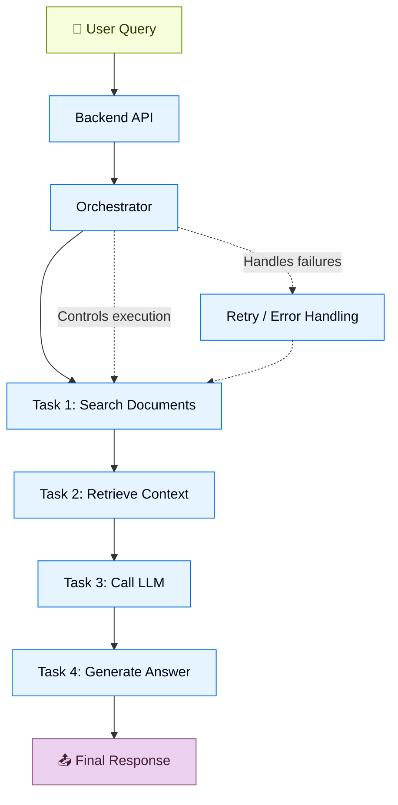

```mermaid
flowchart TD
    A["👤 User Query"] --> B["Backend API"]
    B --> C["Orchestrator"]

    C --> D["Task 1: Search Documents"]
    D --> E["Task 2: Retrieve Context"]
    E --> F["Task 3: Call LLM"]
    F --> G["Task 4: Generate Answer"]
    G --> H["📤 Final Response"]

    C -. "Controls execution" .-> D
    C -. "Handles failures" .-> I["Retry / Error Handling"]
    I -.-> D

    classDef input fill:#F6FFDB,stroke:#6E8900,color:#2E3900
    classDef process fill:#E5F4FF,stroke:#006DDD,color:#030710
    classDef output fill:#EBD0F0,stroke:#885270,color:#441E33

    class A input
    class B,C,D,E,F,G,I process
    class H output
```
